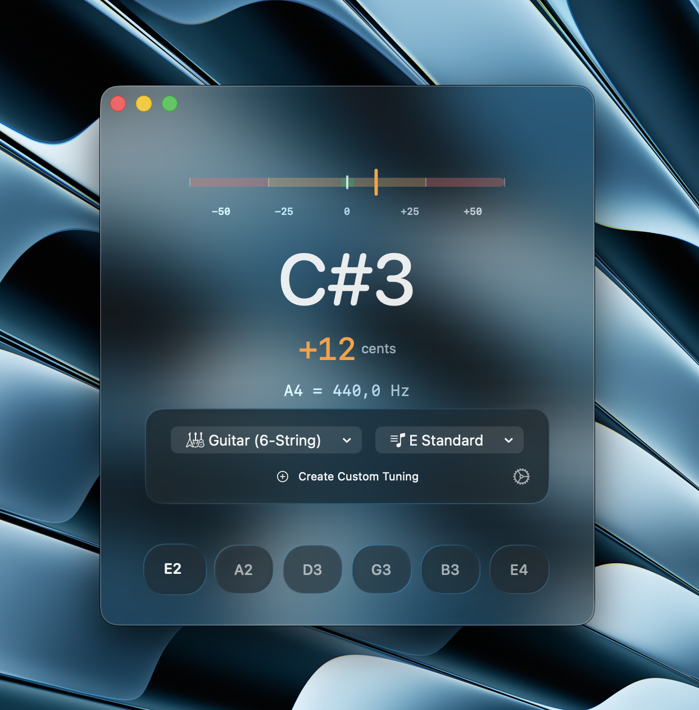

<div align="center">

# QuickTuner

**A macOS-native chromatic guitar & bass tuner built for precision and speed.**

[](https://www.apple.com/macos/)
[](https://swift.org)
[](https://swift.org/package-manager/)
[-lightgrey)](https://developer.apple.com/documentation/apple-silicon/building-a-universal-macos-binary)
[](LICENSE)

<br>



</div>

---

QuickTuner is a lightweight, always-ready instrument tuner that lives on your Mac. It guides you string-by-string through standard and alternate tunings with a focused, single-string workflow — navigate between strings with arrow keys, tune each one, move on. Designed with Apple's Liquid Glass aesthetic: translucent panels, vibrancy blur, and spring-driven animations that feel physically weighted.

No subscriptions. No clutter. Just tune.

---

## Features

- **String-by-String Workflow** — One active string at a time. Navigate with `←` `→` arrow keys, click a string pill, or swipe. Zero friction.
- **Chromatic Needle + Cents Readout** — Large circular gauge with a floating glass needle. Locks center with a satisfying pulse animation when in tune (±2 cents).
- **Adjustable Reference Pitch** — Set A4 from 420–444 Hz. One-click presets for 440 Hz (standard), 432 Hz, and 443 Hz (orchestral).
- **Multi-Instrument Support** — 6, 7, and 8-string guitar; 4, 5, and 6-string bass.
- **30+ Preset Tunings** — Standard, drop, open, and modal tunings. DADGAD, Drop D, Half-Step Down, and many more.
- **Custom Tuning Creator** — Build and save your own tunings. Persisted between launches.
- **Audio Input Selector** — Choose from any Core Audio input device (built-in mic, USB interface, Bluetooth). Selection persists.
- **YIN Pitch Detection** — Sub-cent accuracy using the YIN autocorrelation algorithm via Apple's Accelerate framework. No third-party dependencies.
- **Universal Binary** — Runs native on both Apple Silicon and Intel Macs.
- **Liquid Glass Design** — Full `NSVisualEffectView` vibrancy, layered frosted-glass cards, dark and light mode support.

---

## Requirements

| Requirement | Minimum |
|---|---|
| **macOS** | 15.0 Sequoia |
| **Xcode** | 15.0+ |
| **Swift** | 6.0+ |
| **Architecture** | arm64 (Apple Silicon) or x86_64 (Intel) |

> **Microphone permission** is required for pitch detection. QuickTuner will prompt you on first launch.

---

## Installation

### Download (Recommended)

Grab the latest notarized `.dmg` from the [Releases](../../releases) page, mount it, and drag **QuickTuner.app** to your Applications folder.

### Build from Source

**1. Clone the repository**

```bash
git clone https://github.com/User123331/quicktuner.git
cd quicktuner
```

**2. Open in Xcode**

```bash
open Package.swift
```

Xcode will resolve the Swift Package and open the project automatically.

**3. Select a scheme and build**

- Set the scheme to **QuickTuner**
- Set the destination to **My Mac**
- Press `⌘R` to build and run

**Or build from the command line:**

```bash
swift build -c release
```

The built binary will be at `.build/release/QuickTuner`.

**4. Run tests**

```bash
swift test
```

---

## Usage

1. **Grant microphone access** when prompted on first launch.
2. **Select your instrument** — Guitar or Bass, with string count.
3. **Pick a tuning** — Standard or any alternate from the dropdown.
4. **Tune string by string** — The lowest string is active by default. Play it, watch the needle center, then press `→` to move to the next string.
5. **All Tuned badge** appears when every string shows a checkmark.

**Keyboard shortcuts**

| Key | Action |
|---|---|
| `←` / `→` | Previous / Next string |
| `Space` | Reset to first string |

**Reference pitch**

Open Settings (`⌘,`) to adjust the A4 reference frequency. Presets for 440, 432, and 443 Hz are one click away.

---

## Architecture

```
┌─────────────────────────────────────────────┐
│                  SwiftUI View               │
│  ┌──────────┐  ┌──────────┐  ┌───────────┐ │
│  │  Gauge   │  │  String  │  │ Settings  │ │
│  │  Needle  │  │  Rail    │  │  Sheet    │ │
│  └────┬─────┘  └────┬─────┘  └─────┬─────┘ │
│       └──────────────┴──────────────┘       │
│                      │                      │
│        ┌─────────────▼──────────────┐       │
│        │       TunerViewModel        │       │
│        │  pitch / cents / inTune     │       │
│        │  selectedString, refHz      │       │
│        └─────────────┬──────────────┘       │
│                      │                      │
│        ┌─────────────▼──────────────┐       │
│        │     AudioEngine (actor)     │       │
│        │  AVAudioEngine → ring buf   │       │
│        │  device enumeration         │       │
│        └─────────────┬──────────────┘       │
│                      │                      │
│        ┌─────────────▼──────────────┐       │
│        │  PitchDetector (Accelerate) │       │
│        │  FFT → YIN → Hz → note      │       │
│        └────────────────────────────┘       │
└─────────────────────────────────────────────┘
```

| Layer | Technology |
|---|---|
| UI | SwiftUI (macOS 15+) |
| Audio Capture | AVAudioEngine / Core Audio |
| Pitch Detection | Accelerate / vDSP — YIN autocorrelation |
| Persistence | UserDefaults + Codable + actor-isolated JSON |
| Build | Swift Package Manager (no external dependencies) |

---

## Project Structure

```
quicktuner/
├── Source/
│   ├── App/             # Entry point, app lifecycle
│   ├── Audio/           # AVAudioEngine, RingBuffer, device management
│   ├── AudioBridge/     # Objective-C++ Core Audio bridge
│   ├── DSP/             # PitchDetector, YINConfig
│   ├── Models/          # Note, Tuning, InstrumentType, StringInfo
│   ├── Services/        # TuningLibrary, PersistenceService, PresetTunings
│   ├── ViewModels/      # TunerViewModel
│   └── Views/           # All SwiftUI views and components
├── Tests/               # Unit and integration tests
├── Resources/           # Asset catalogs
└── Package.swift
```

---

## Contributing

Contributions are welcome. Please open an issue first to discuss what you'd like to change.

1. Fork the repo
2. Create your feature branch (`git checkout -b feature/my-feature`)
3. Commit your changes (`git commit -m 'feat: add my feature'`)
4. Push to the branch (`git push origin feature/my-feature`)
5. Open a Pull Request

---

## License

MIT — see [LICENSE](LICENSE) for details.
